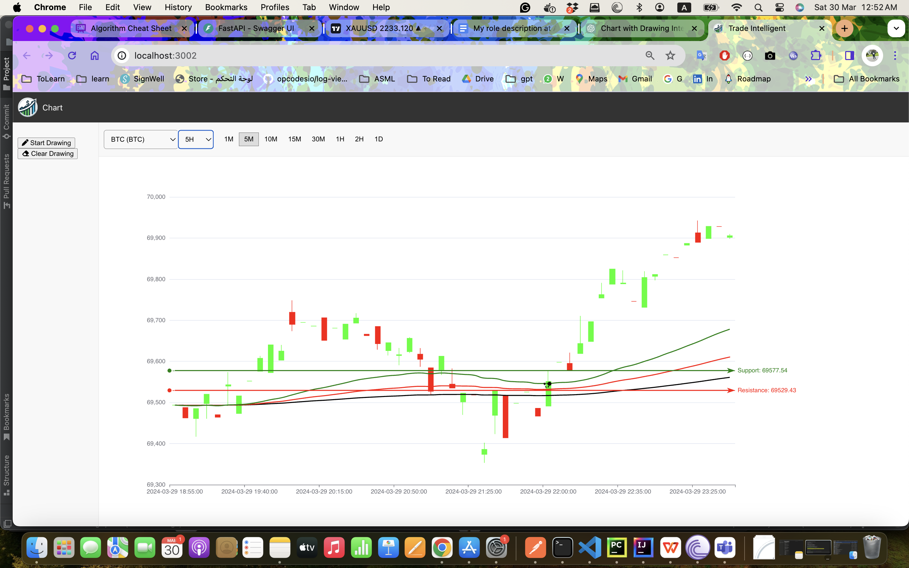

# TradeIntelli AI

## Overview
TradeIntelli AI is a cutting-edge trading platform that leverages artificial intelligence to provide users with intelligent trading insights, predictive analytics, and automated trading indicators. Designed for both amateur and seasoned traders, TradeIntelli AI aims to democratize access to advanced trading analytics, making it easier to make informed decisions in the volatile world of stock trading.


## Features
- **AI-Powered Indicators**: Utilize machine learning models to generate predictive trading signals.
- **Real-Time Market Data**: Access up-to-the-minute prices and market movements.
- **Customizable Dashboard**: Tailor your trading dashboard to highlight the information most relevant to you.
- **Backtesting Suite**: Test trading strategies with historical data before applying them in real markets.

## Getting Started

### Prerequisites
- Python 3.8+
- pip (Python Package Installer)

### Installation

1. Clone the repository:
   ```sh
   git clone https://github.com/yourusername/TradeIntelliAI.git
   ```

2. Navigate to the project directory:
   ```sh
   cd TradeIntelliAI
   ```

3. Install required dependencies:
   ```sh
   pip install -r requirements.txt
   ```

### Setting Up
1. Obtain necessary API keys for market data (e.g., Alpaca, Alpha Vantage).
2. Configure your environment variables to include these API keys:
   ```env
   ALPACA_API_KEY=your_alpaca_api_key
   ALPHA_VANTAGE_KEY=your_alpha_vantage_key
   ```

### Running the Application
To start the application, run:
```sh
python app.py
```
Navigate to `http://localhost:8000` to view the dashboard.

## Usage
- **Selecting a Stock**: Use the stock selector to choose the stock you wish to analyze.
- **Choosing a Time Frame**: Select from various time frames (e.g., 1H, 1D) to view the corresponding market data and AI-generated indicators.
- **Analyzing Trends**: Review the AI insights and predictive indicators to inform your trading decisions.

## Contributing
Contributions are what make the open-source community such an amazing place to learn, inspire, and create. Any contributions you make are **greatly appreciated**.

1. Fork the Project
2. Create your Feature Branch (`git checkout -b feature/AmazingFeature`)
3. Commit your Changes (`git commit -m 'Add some AmazingFeature'`)
4. Push to the Branch (`git push origin feature/AmazingFeature`)
5. Open a Pull Request

## License
Distributed under the MIT License. See `LICENSE` for more information.

## API docs Open API swagger
http://127.0.0.1:8000/docs

## Frontend
http://localhost:3001


## Todo:
1. Zoom in and Out
2. allow DI with indicators 
3. add unit tests 
4. add react to docker